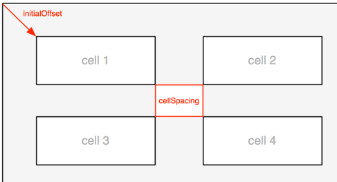

# ARFramesInGridCalculator

[](http://cocoadocs.org/docsets/ARFramesInGridCalculator)
[](http://cocoadocs.org/docsets/ARFramesInGridCalculator)
[](http://cocoadocs.org/docsets/ARFramesInGridCalculator)

## Introduction

This simple tool is used in every app I ever did. It is nothing fancy, just convenience. I like things nicely aligned, and this makes it really easy. Once you've tried it, you'll be hooked.

## Description

ARFramesInGridCalculator is a single class that will calculate frames in a grid that you specified. Useful for placing buttons, images, textfields, etc. Furthermore ARFramesInGridCalculator makes it really easy to adjust the layout to match design specifications.

## Usage

Initialize with a `cellSize` and information about how to arrange the cells. 

```
	ARFramesInGridCalculator *calculator = [[ARFramesInGridCalculator alloc] initWithCellSize:CGSizeMake(80.0, 30.0) rowCount:0 columnCount:2 andDirection:ARFramesInGridDirectionHorizontal];
```

(If you set rowCount to `0` there will be no limit on the amount of rows.)

Optionally set the `initialOffset` and `cellSpacing` properties.




The method `frameForIndex:` is what you will use most. For example:

```
	for (int i = 0; i < 14; i ++)
	{
		UILabel *test = [[UILabel alloc] initWithFrame:[calculator frameForIndex:i]];
		[self.gridContainerView addSubview:test];
	}
```


There are more methods availabele wich are documented in the header file but worth mentioning here:

- To calculate the resulting cell width when margin is fixed:
`setCellWidthToFitWidth:count:horizontalMargin:`*

- For a given cell width and totalWidth, calculate margin for even layout.
`setHorizontalMarginForTotalWidth:cellWidth:count:`*

\* When using these methods `cellSize.width`, `initialOffset.x` and `cellSpacing.width` will all be set;


## Installation

ARFramesInGridCalculator is available through [CocoaPods](http://cocoapods.org). To install
it, simply add the following line to your Podfile:

    pod "ARFramesInGridCalculator"

## Author

Gijs van Klooster, gijs@appyroad.com

## License

ARFramesInGridCalculator is available under the MIT license. See the LICENSE file for more info.

